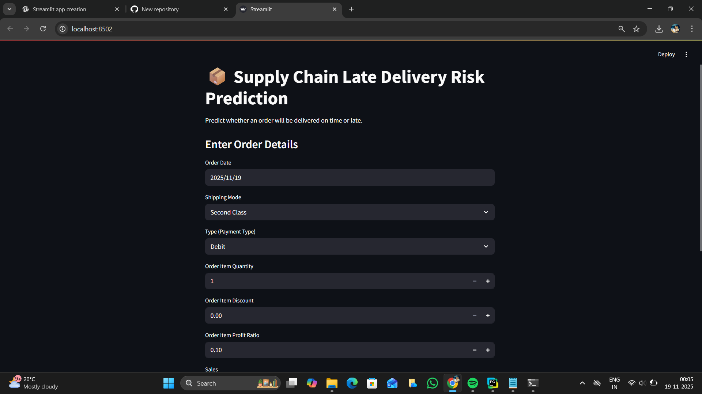
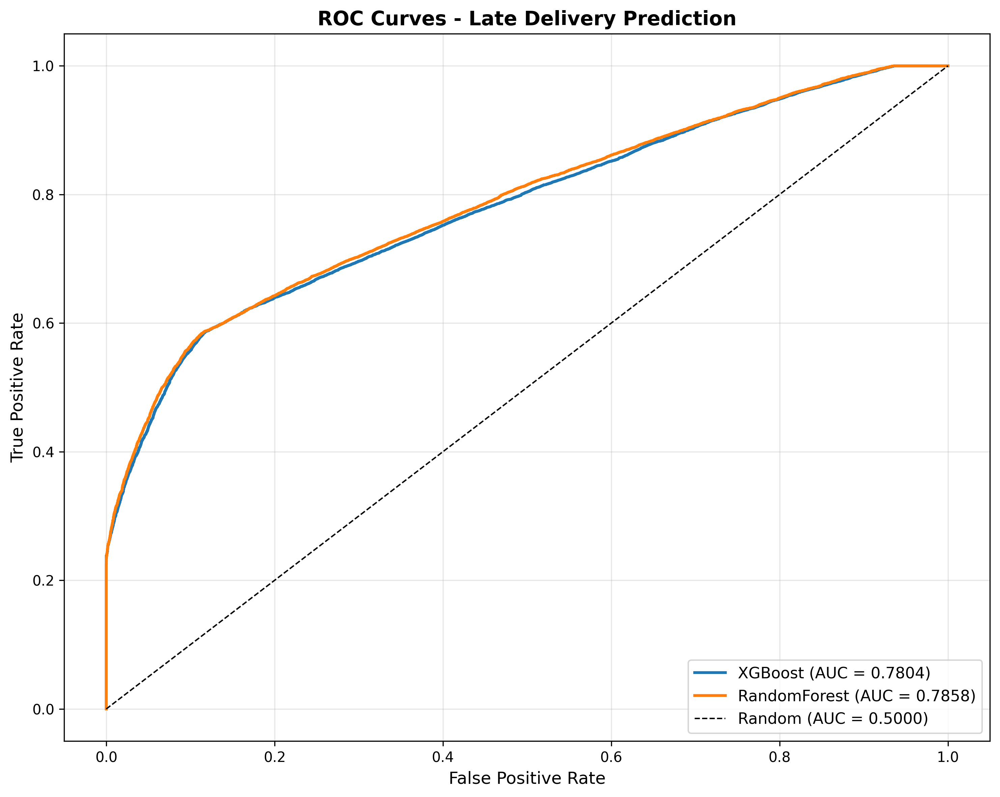
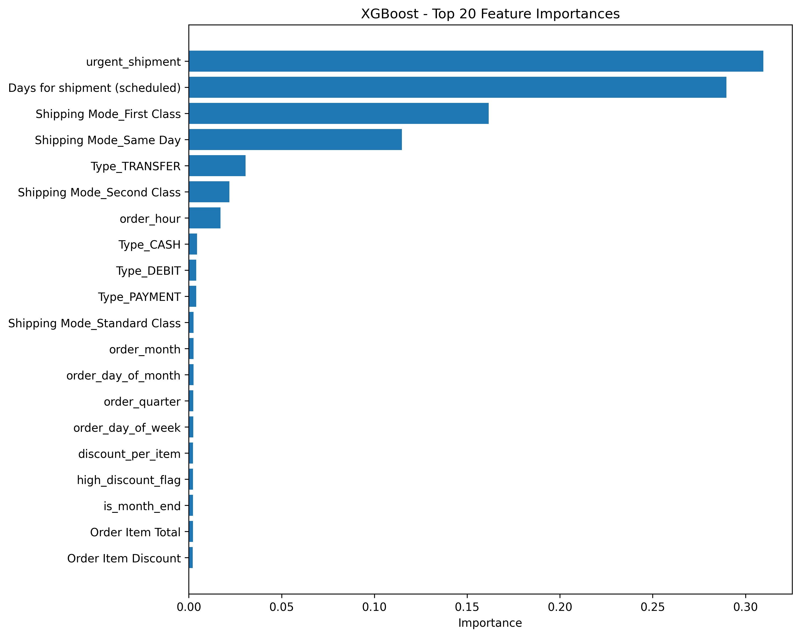

# 📦 Supply Chain Late Delivery Risk Prediction

A complete end-to-end Machine Learning + Streamlit application that predicts whether an order will be delivered **on time** or **late**, using the DataCo Supply Chain dataset. This project showcases advanced feature engineering, model training (XGBoost & Random Forest), and a fully interactive UI for real-time predictions.

---

## 🧠 Project Summary

Late deliveries significantly affect logistics, customer satisfaction, and operational costs. This project builds a predictive system that:

* Learns patterns from **90,000+ supply chain records**
* Predicts late delivery risk based on order metadata
* Uses advanced ML models (XGBoost, RandomForest)
* Provides a **Streamlit UI** for business-friendly predictions

The final output looks like this:



---

## 🚀 Project Features

### ✔ Machine Learning Pipeline

* Automatic feature engineering (dates, flags, interactions)
* Missing value handling
* One-Hot Encoding & Scaling
* Hyperparameter-tuned XGBoost & RandomForest
* ROC-AUC validated performance

### ✔ Streamlit Web App

* Clean modern UI
* Simple 7-field input form
* Beautiful prediction cards (Green = On Time, Red = Late)
* Auto-computed engineered features

### ✔ Model Insights

* Feature importance charts
* ROC Curve comparison
* Stored metadata for reproducibility

---

## 📁 Project Structure

```
Predicting-Delivery-Delays-in-Supply-Chain/
│── app_compare.py               # Streamlit Application
│── README.md                    # Project Documentation (this file)
│── DataCoSupplyChainDataset.csv # Dataset
│── requirements.txt             # Dependencies
│── models_fixed/                # Final trained models & metadata
│     ├── best_model.pkl
│     ├── xgb_model.pkl
│     ├── rf_model.pkl
│     ├── model_metadata.json
│     ├── feature_list.txt
│     ├── xgboost_feature_importance.png
│     ├── randomforest_feature_importance.png
│     ├── roc_curves.png
│── models/                      # Earlier experiment models
│── output.png                   # Streamlit screenshot
│── output (2).png
│── scaler.pkl
│── OnTime_Delivery_Project_CLEAN.ipynb # Data exploration
```

---

## 📦 Dataset

**Source:** [https://www.kaggle.com/datasets/shashwatwork/dataco-smart-supply-chain-for-big-data-analysis/data](https://www.kaggle.com/datasets/shashwatwork/dataco-smart-supply-chain-for-big-data-analysis/data)

The dataset contains:

* Order metadata
* Customer info
* Shipping schedules
* Payment types
* Actual vs scheduled delivery time

---

## 🔧 Feature Engineering (Key Features)

The app automatically extracts features like:

### 📅 Date-based

* Order Month / Quarter
* Business Hours Flag
* Weekend Flag
* Month End Flag

### 📦 Shipment

* Days for Shipment (scheduled)
* Urgent Shipment Flag (≤ 2 days)

### 🛒 Product

* Price per Item
* Discount per Item
* High Discount Flag

These features significantly improve model accuracy.

---

## 🧪 Model Training & Evaluation

### Trained Models

* **XGBoost Classifier**
* **RandomForest Classifier**

### Validation

* 5-Fold Stratified Cross Validation
* ROC-AUC scoring

### Results

The best model (stored as `best_model.pkl`) is selected automatically based on highest AUC.

---

## ▶️ Running the Streamlit App

### 1️⃣ Install Dependencies

```
pip install -r requirements.txt
```

### 2️⃣ Run App

```
streamlit run app_compare.py
```

### 3️⃣ Open in Browser

```
http://localhost:8501
```

---

## 📈 Visual Outputs

### ROC Curve



### Feature Importance Example



---

## 🌟 Future Enhancements

* CSV Bulk Predictions
* SHAP Explainability (Why prediction?)
* Interactive Dashboard (tabs)
* Automated benchmarking reports
* Cloud deployment (Streamlit Cloud / AWS)

---

## 👨‍💻 Author

**S.V Murali**
Machine Learning | Data Engineering | Python | Streamlit

GitHub: [https://github.com/Murali1502](https://github.com/Murali1502)

---

## ⭐ Support the Project

If this project helped you, please consider giving it a **⭐ star on GitHub**. It motivates future improvements!
